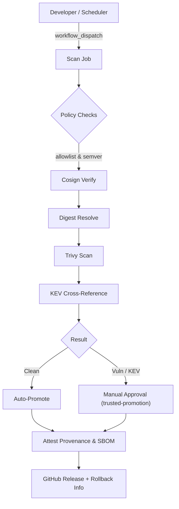

# 🔐 Secure Deploy – Enterprise Vendor Image Ingestion Pipeline

[](https://github.com/svveec0d3/secure-deploy/actions/workflows/ci.yml)
[](https://github.com/svveec0d3/secure-deploy/actions/workflows/image-promotion.yml)

A reference implementation that shows **how to securely ingest, verify and deploy vendor‑supplied container images** (demoed with [n8n](https://n8n.io)). It bundles industry‑grade best practices – **SLSA**, **CIS Docker Benchmark v1.6.0**, and **NIST SP 800‑53** – into a GitHub‑Actions CI/CD pipeline.

---

## 1️⃣ Threat Model & Risk Impact

| Threat | Description | Risk / Impact |
|-------|-------------|---------------|
| **Mutable tags** | Use of `:latest` or other mutable tags lets the image change silently. | Supply‑chain compromise, hidden back‑doors. |
| **Unknown provenance** | No cryptographic proof the image originates from the vendor. | Tampering, malicious inserts. |
| **Missing audit trail** | No immutable record of which version was deployed, who approved it, and when. | Forensic gaps, regulatory non‑compliance. |
| **Delayed CVE exposure** | Images become vulnerable as new CVEs are disclosed after promotion. | Production breach risk, patch‑lag. |
| **Runtime escape** | Container can break out of its isolation and affect the host. | Privilege escalation, data exfiltration. |
| **Insufficient documentation** | Operators lack clear guidance on remediation and rollback. | Operational error, prolonged downtime. |

---

## 2️⃣ Controls Mapping & Mitigation (with SLSA Level)

| Threat | Control | Implementation Detail | Mitigation | SLSA Maturity |
|-------|--------|----------------------|------------|----------------|
| Mutable tags | **Digest pinning** | Resolve SHA‑256 digest at ingestion; runtime uses `image@sha256:<digest>` | Guarantees immutable image content. | **Level 3** – Provenance attestation & reproducible builds |
| Unknown provenance | **SLSA Provenance attestation** | `actions/attest-build-provenance` attaches signed provenance to each promoted image. | Cryptographic proof of origin. | **Level 3** |
| Unknown provenance | **Cosign signature verification** | Verify vendor‑signed OCI signatures before promotion. | Detects unsigned or tampered images. | **Level 2** |
| Unknown provenance | **Source allowlist** | `policy/image‑ingestion‑policy.yml` restricts to `n8nio/n8n` with strict `x.y.z` semver. | Blocks unexpected sources. | **Level 2** |
| Missing audit trail | **SBOM generation** | Syft creates SPDX SBOM; stored as artifact and attested. | Full component inventory for compliance. | **Level 2** |
| Missing audit trail | **Versioned GitHub Releases** | Each promotion creates a release with digest, SBOM, and provenance links. | Immutable record of deployment. | **Level 3** |
| Delayed CVE exposure | **Trivy CVE scan** | Scans all severities; fails on CRITICAL/HIGH. | Early detection of vulnerable images. | **Level 2** |
| Delayed CVE exposure | **CISA KEV cross‑reference** | Automated check against known‑exploited CVE list. | Blocks actively exploited vulnerabilities. | **Level 2** |
| Runtime escape | **CIS Docker Benchmark v1.6.0 (Section 5)** | Enforced via `policy/runtime‑hardening‑policy.yml` – read‑only FS, `no‑new‑privileges`, `cap_drop: ALL`, AppArmor, non‑root user, resource limits, custom network. | Reduces blast radius, enforces least privilege. | **Level 2** |
| Operational gaps | **Approval gate** | `trusted‑promotion` environment requires manual review for flagged images. | Human risk acceptance decision. | **Level 2** |
| Operational gaps | **Weekly re‑scan** | `rescan.yml` re‑scans all promoted images; opens issue on new findings. | Continuous compliance monitoring. | **Level 2** |
| Operational gaps | **Host verification script** | `install.sh` runs `gh attestation verify` against exact digest before deployment. | Guarantees host runs the exact promoted image. | **Level 3** |

**SLSA Maturity**: This repository demonstrates **SLSA Level 3**. By generating signed provenance attestations for every promoted image, pinning digests, and publishing reproducible SBOMs, it meets the requirements for automated provenance verification and reproducible builds, which are the hallmarks of Level 3.

---

## 3️⃣ Pipeline Architecture



* **Auto‑Promote** – No findings, image is pushed to GHCR and released.
* **Manual Approval** – Critical/High CVEs or KEV hit require reviewer sign‑off.
* All steps produce **artifacts** (reports, SBOM, provenance) and write a **Job Summary** for immediate visibility.

---

## 4️⃣ Repository Structure

```
.
├── policy/
│   ├── image‑ingestion‑policy.yml      # Allowlist, tag pattern, vendor signature mode
│   ├── vulnerability‑gate‑policy.yml   # CVE/KEV block rules, exception process, re‑scan policy
│   ├── runtime‑hardening‑policy.yml    # CIS Docker Benchmark v1.6.0 compliance table (Section 5)
│   └── cis‑docker‑hardening.md         # Human‑readable reference for all CIS checks performed
│
├── .github/workflows/
│   ├── ci.yml               # Pre‑merge: IaC & secret scan + CIS compliance (blocks on findings)
│   ├── image‑promotion.yml  # Vendor image ingestion, scanning, attestation, promotion
│   └── rescan.yml           # Weekly re‑scan of all promoted images
│
└── iac/n8n/
    ├── docker-compose.yml   # CIS‑hardened stack (read‑only FS, non‑root, AppArmor, limits)
    ├── .env.template        # Template – copy to .env and populate
    └── install.sh           # Interactive setup: version selection, digest fetch, provenance verify, deploy
```

---

## 5️⃣ Operational Playbooks

### 📦 Promotion Runbook
1. **Actions → Image Promotion (Trusted Source) → Run workflow**
2. Provide a version (e.g. `1.55.3`) or leave blank for auto‑resolve.
3. Pipeline runs: policy → cosign → digest → Trivy → KEV → gate.
4. **If clean** – Auto‑promoted, GitHub Release created with digest & rollback info.
5. **If vulnerable** – Workflow pauses; reviewer downloads `scan-report-<version>` artifact, reviews `trivy‑summary.txt` and `vendor‑sig‑check.txt`, then approves or rejects in the `trusted‑promotion` environment.

### ⚖️ Exception / Waiver Process
1. Download the scan artifact as evidence.
2. Document accepted risk (CVE IDs, severity, KEV status, business justification) in the release notes.
3. Set a **review deadline** – date by which a patched version must be deployed or the exception renewed.
4. Update `policy/vulnerability‑gate‑policy.yml` comments to reflect the new waiver.

### 🔄 Rollback Procedure
```bash
# Edit .env with values from the target release
nano iac/n8n/.env
# Example values
N8N_IMAGE_VERSION=1.54.0
N8N_IMAGE_DIGEST=sha256:abcd1234...
# Apply
docker compose up -d
```
Or re‑run `install.sh` and supply the target version when prompted.

### ⏱️ Re‑Scan & Patch Cadence
| Trigger | Action |
|---------|--------|
| Weekly (Mon 00:00 UTC) | `rescan.yml` re‑scans all GHCR images; opens a GitHub Issue on new findings |
| New CVE in CISA KEV list | Issue opened automatically on next scan – treat as P1 |
| New vendor release | Run promotion pipeline manually |

---

## 6️⃣ Security Policy (High‑Level)
- **Image source**: Must be `ghcr.io/svveec0d3/secure-deploy/*`; never pull directly from Docker Hub in production.
- **SLSA provenance**: Every promoted image is signed with `actions/attest-build-provenance` (SLSA Level 3).
- **SBOM**: Generated via Syft and attested to the registry.
- **CIS hardening**: Enforced by `runtime‑hardening‑policy.yml` (Section 5 controls).
- **Vulnerability gating**: Trivy + CISA KEV; critical/high findings block promotion.
- **Approval workflow**: `trusted‑promotion` environment for manual risk acceptance.
- **Policy changes**: Require a reviewed pull request.

---

## 7️⃣ References & Best‑Practice Guides
- **SLSA** – https://slsa.dev/spec/v1.0
- **CIS Docker Benchmark v1.6.0** – https://www.cisecurity.org/benchmark/docker
- **NIST SP 800‑53 Rev 5** – https://csrc.nist.gov/publications/sp800-53/rev-5
- **CISA Known Exploited Vulnerabilities (KEV)** – https://www.cisa.gov/known-exploited-vulnerabilities-catalog

---

## 8️⃣ One‑Time GitHub Setup
1. **Settings → Environments → New environment** → name `trusted‑promotion`; enable required reviewers.
2. **Settings → Actions → General → Workflow permissions** → **Read and write permissions**.
3. **Packages → `n8n‑trusted` → Settings → Change visibility → Public** (required for OCI attestation).

---

## 9️⃣ Deploying to a Host
```bash
# Clone the repository on the VM
git clone https://github.com/svveec0d3/secure-deploy.git
cd secure-deploy/iac/n8n

# Install GitHub CLI (recommended for provenance verification)
# https://github.com/cli/cli#installation
gh auth login

# Run the interactive installer
chmod +x install.sh
./install.sh
# Prompts: host IP, version (or auto‑resolve), resource limits, provenance verification
```
**Automation mode** (no prompts): `./install.sh --skip-verify`

---

*This README is version‑controlled; any changes to policies or controls must be reviewed via pull request to maintain auditability.*

[](https://github.com/svveec0d3/secure-deploy/actions/workflows/ci.yml)
[](https://github.com/svveec0d3/secure-deploy/actions/workflows/image-promotion.yml)
