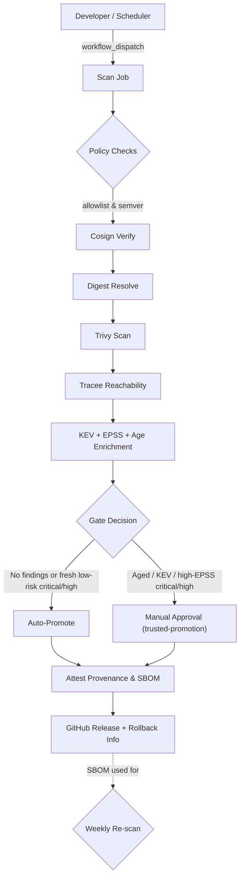

# 🔐 Secure Deploy – Enterprise Vendor Image Ingestion Pipeline

[](https://github.com/svveec0d3/secure-deploy/actions/workflows/ci.yml)
[](https://github.com/svveec0d3/secure-deploy/actions/workflows/image-promotion.yml)

A reference implementation that shows **how to securely ingest, verify and deploy vendor‑supplied container images** (demoed with [n8n](https://n8n.io)). It bundles industry‑grade best practices – **SLSA**, **CIS Docker Benchmark v1.6.0**, and **NIST SP 800‑53** – into a GitHub‑Actions CI/CD pipeline.

---

## 1️⃣ Threat Model & Risk Impact

| Threat | Description | Risk / Impact |
|-------|-------------|---------------|
| **Mutable tags** | Use of `:latest` or other mutable tags lets the image change silently. | Supply‑chain compromise, hidden back‑doors. |
| **Unknown provenance** | No cryptographic proof the image originates from the vendor. | Tampering, malicious inserts. |
| **Missing audit trail** | No immutable record of which version was deployed, who approved it, and when. | Forensic gaps, regulatory non‑compliance. |
| **Delayed CVE exposure** | Images become vulnerable as new CVEs are disclosed after promotion. | Production breach risk, patch‑lag. |
| **Runtime escape** | Container can break out of its isolation and affect the host. | Privilege escalation, data exfiltration. |
| **Insufficient documentation** | Operators lack clear guidance on remediation and rollback. | Operational error, prolonged downtime. |

---

## 2️⃣ Controls Mapping & Mitigation (with SLSA Level)

| Threat | Control | Implementation Detail | Mitigation | SLSA Maturity |
|-------|--------|----------------------|------------|----------------|
| Mutable tags | **Digest pinning** | Resolve SHA‑256 digest at ingestion; runtime uses `image@sha256:<digest>` | Guarantees immutable image content. | **Level 3** – Provenance attestation & reproducible builds |
| Unknown provenance | **SLSA Provenance attestation** | `actions/attest-build-provenance` attaches signed provenance to each promoted image. | Cryptographic proof of origin. | **Level 3** |
| Unknown provenance | **Cosign signature verification** | Verify vendor‑signed OCI signatures before promotion. | Detects unsigned or tampered images. | **Level 2** |
| Unknown provenance | **Source allowlist** | `policy/image‑ingestion‑policy.yml` restricts to `n8nio/n8n` with strict `x.y.z` semver. | Blocks unexpected sources. | **Level 2** |
| Missing audit trail | **SBOM generation** | Syft creates SPDX SBOM; stored as artifact and attested. | Full component inventory for compliance. | **Level 2** |
| Missing audit trail | **Versioned GitHub Releases** | Each promotion creates a release with digest, SBOM, and provenance links. | Immutable record of deployment. | **Level 3** |
| Delayed CVE exposure | **Trivy CVE scan** | Scans all severities and enriches each CVE with age, KEV, EPSS, and runtime reachability context. | Early detection with exploitability context. | **Level 2** |
| Delayed CVE exposure | **Tracee runtime reachability** | Observes executed binaries and loaded files during a smoke run to flag whether vulnerable packages are exercised. | Distinguishes dormant package CVEs from runtime-touched package CVEs. | **Level 2** |
| Delayed CVE exposure | **CISA KEV cross‑reference** | Automated check against known‑exploited CVE list. | Blocks actively exploited CRITICAL/HIGH vulnerabilities. | **Level 2** |
| Delayed CVE exposure | **FIRST EPSS enrichment** | Pulls EPSS for every discovered CVE and classifies exploitation likelihood. | Separates fresh low-probability findings from urgent exploitation risk. | **Level 2** |
| Runtime escape | **CIS Docker Benchmark v1.6.0 (Section 5)** | Enforced via `policy/runtime‑hardening‑policy.yml` – read‑only FS, `no‑new‑privileges`, `cap_drop: ALL`, AppArmor, non‑root user, resource limits, custom network. | Reduces blast radius, enforces least privilege. | **Level 2** |
| Operational gaps | **Approval gate** | `trusted‑promotion` environment requires manual review for flagged images. | Human risk acceptance decision. | **Level 2** |
| Operational gaps | **Weekly re‑scan** | `rescan.yml` re‑scans the SBOM of all promoted releases; opens issue on new findings. | Continuous compliance monitoring. | **Level 2** |
| Operational gaps | **Host verification script** | `install.sh` runs `gh attestation verify` against exact digest before deployment. | Guarantees host runs the exact promoted image. | **Level 3** |

**SLSA Maturity**: This repository demonstrates **SLSA Level 3**. By generating signed provenance attestations for every promoted image, pinning digests, and publishing reproducible SBOMs, it meets the requirements for automated provenance verification and reproducible builds, which are the hallmarks of Level 3.

---

## 3️⃣ Pipeline Architecture


```mermaid
flowchart TD
    A[Developer / Scheduler] -->|workflow_dispatch| B[Scan Job]
    B --> C{Policy Checks}
    C -->|allowlist & semver| D[Cosign Verify]
    D --> E[Digest Resolve]
    E --> F[Trivy Scan]
    F --> G[Tracee Reachability]
    G --> H[KEV + EPSS + Age Enrichment]
    H --> I{Gate Decision}
    I -->|No findings or fresh low-risk critical/high| J[Auto‑Promote]
    I -->|Aged / KEV / high-EPSS critical/high| K["Manual Approval (trusted‑promotion)"]
    J --> L[Attest Provenance & SBOM]
    K --> L
    L --> M[GitHub Release + Rollback Info]
    M -.->|SBOM used for| N{Weekly Re-scan}
```

* **Auto‑Promote** – No findings, or only CRITICAL/HIGH CVEs that are under 30 days old, not in KEV, and below this repository's EPSS manual-review threshold.
* **Manual Approval** – Any CRITICAL/HIGH CVE that is at least 30 days old, in KEV, or crosses this repository's EPSS manual-review threshold.
* Vulnerability tables now include a **Reachability** column based on Tracee runtime evidence from the smoke test.
* All steps produce **artifacts** (reports, SBOM, provenance, Tracee reachability logs) and write a **Job Summary** for immediate visibility.

### EPSS Policy Cheat Sheet

EPSS is the estimated probability that a CVE will be exploited in the next 30 days. The percentage itself comes from FIRST EPSS. The labels below are not an official EPSS standard; they are repository-defined policy bands used only for promotion decisions in this project.

For example, an EPSS score of `2.1%` means a modeled `2.1%` probability of exploitation within 30 days. In this repository, that score falls above the `2.0%` manual-review threshold, so a `CRITICAL` or `HIGH` CVE with that score requires manual approval.

| EPSS Score Range | Repository Policy Band | Meaning | Action |
|-------|--------|---------|--------|
| `< 0.5%` | Low | Exploitation is currently unlikely at internet scale. | Normal patching cadence; does not block auto-promotion by itself. |
| `0.5% to < 2.0%` | Medium | Elevated likelihood, but below this repository's manual-review threshold. | Prioritize patching soon; still auto-eligible if age and KEV checks are clear. |
| `2.0% to < 10.0%` | High | Above this repository's manual-review threshold. | Manual review required for CRITICAL/HIGH CVEs. |
| `>= 10.0%` | Critical | Very high exploitation likelihood. | Treat as urgent; manual approval only for CRITICAL/HIGH CVEs. |

---

## 4️⃣ Repository Structure

```
.
├── policy/
│   ├── image‑ingestion‑policy.yml      # Allowlist, tag pattern, vendor signature mode
│   ├── vulnerability‑gate‑policy.yml   # CVE/KEV block rules, exception process, re‑scan policy
│   ├── runtime‑hardening‑policy.yml    # CIS Docker Benchmark v1.6.0 compliance table (Section 5)
│   └── cis‑docker‑hardening.md         # Human‑readable reference for all CIS checks performed
│
├── .github/workflows/
│   ├── ci.yml               # Pre‑merge: IaC & secret scan + CIS compliance (blocks on findings)
│   ├── image‑promotion.yml  # Vendor image ingestion, EPSS/KEV/age gating, attestation, promotion
│   └── rescan.yml           # Weekly re‑scan of promoted release SBOMs
│
└── iac/n8n/
    ├── docker-compose.yml   # CIS‑hardened stack (read‑only FS, non‑root, AppArmor, limits)
    ├── .env.template        # Template – copy to .env and populate
    ├── install.sh           # Interactive setup: version, resource limits, provenance verify, deploy, auto‑upgrade
    └── upgrade.sh           # Auto‑upgrade: checks latest release, upgrades, health‑checks, rolls back on failure
```

---

## 5️⃣ Operational Playbooks

### 📦 Promotion Runbook
1. **Actions → Image Promotion (Trusted Source) → Run workflow**
2. Provide a version (e.g. `1.55.3`) or leave blank for auto‑resolve.
3. Pipeline runs: policy → cosign → digest → Trivy → Tracee reachability smoke test → KEV/EPSS/age enrichment → gate.
4. **If auto‑eligible** – Auto‑promoted, GitHub Release created with digest & rollback info.
5. **If manual review is required** – Workflow pauses; reviewer downloads `scan-report-<version>` artifact, reviews `trivy‑summary.txt` and `vendor‑sig‑check.txt`, then approves or rejects in the `trusted‑promotion` environment.

### ⚖️ Exception / Waiver Process
1. Download the scan artifact as evidence.
2. Document accepted risk (CVE IDs, severity, CVE age, KEV status, EPSS score, business justification) in the release notes.
3. Set a **review deadline** – date by which a patched version must be deployed or the exception renewed.
4. Update `policy/vulnerability‑gate‑policy.yml` comments to reflect the new waiver.

### 🔄 Rollback Procedure

`install.sh` automatically prints a ready‑to‑run rollback command at the end of each deployment:
```bash
# Printed by install.sh after every successful deploy:
sed -i 's|^N8N_IMAGE_IDENTIFIER=.*|N8N_IMAGE_IDENTIFIER=@sha256:<prev>|' .env && docker compose up -d
```
Simply copy and run the printed command. The previous `N8N_IMAGE_IDENTIFIER` (digest or tag) is captured automatically before it is overwritten.

Alternatively, re‑run `install.sh` and supply the target version when prompted. `upgrade.sh` also performs an automatic rollback if the upgraded container fails its health check.

### ⏱️ Re‑Scan & Patch Cadence
| Trigger | Action |
|---------|--------|
| Weekly (Mon 00:00 UTC) | `rescan.yml` re‑scans the SBOM of all promoted releases; opens a GitHub Issue on new findings |
| New CVE in CISA KEV list | Issue opened automatically on next scan – treat as P1 |
| Existing CVE crosses EPSS HIGH threshold | Issue opened automatically on next scan – re-evaluate exception immediately |
| New vendor release | Run promotion pipeline manually; or let **auto‑upgrade** handle deployment (see below) |
| Daily 03:00 (optional) | `upgrade.sh` checks for new releases, upgrades, verifies health, rolls back on failure |

---

## 6️⃣ Security Policy (High‑Level)
- **Image source**: Must be `ghcr.io/svveec0d3/secure-deploy/*`; never pull directly from Docker Hub in production.
- **SLSA provenance**: Every promoted image is signed with `actions/attest-build-provenance` (SLSA Level 3).
- **SBOM**: Generated via Syft and attested to the registry.
- **CIS hardening**: Enforced by `runtime‑hardening‑policy.yml` (Section 5 controls).
- **Vulnerability gating**: Trivy + CISA KEV + FIRST EPSS + CVE age. Fresh CRITICAL/HIGH findings can auto-promote only when KEV is clear and EPSS stays below HIGH.
- **Approval workflow**: `trusted‑promotion` environment for manual risk acceptance.
- **Policy changes**: Require a reviewed pull request.

---

## 7️⃣ References & Best‑Practice Guides
- **SLSA** – https://slsa.dev/spec/v1.0
- **CIS Docker Benchmark v1.6.0** – https://www.cisecurity.org/benchmark/docker
- **NIST SP 800‑53 Rev 5** – https://csrc.nist.gov/publications/sp800-53/rev-5
- **CISA Known Exploited Vulnerabilities (KEV)** – https://www.cisa.gov/known-exploited-vulnerabilities-catalog
- **FIRST EPSS** – https://www.first.org/epss/

---

## 8️⃣ One‑Time GitHub Setup
1. **Settings → Environments → New environment** → name `trusted‑promotion`; enable required reviewers.
2. **Settings → Actions → General → Workflow permissions** → **Read and write permissions**.
3. **Packages → `n8n‑trusted` → Settings → Change visibility → Public** (required for OCI attestation).

---

## 9️⃣ Deploying to a Host
```bash
# Clone the repository on the VM
git clone https://github.com/svveec0d3/secure-deploy.git
cd secure-deploy/iac/n8n

# Install GitHub CLI (recommended for provenance verification)
# https://github.com/cli/cli#installation
gh auth login

# Run the interactive installer
chmod +x install.sh
./install.sh
```
`install.sh` prompts for:
- **Host IP** – auto‑detected, confirm or override
- **Version** – explicit semver or auto‑resolve latest from GitHub Releases
- **Resource limits** – memory, CPU, PID caps (CIS hardening)
- **GHCR digest** – fetched automatically from the release body; the bare hex hash is accepted and `sha256:` is prepended automatically
- **Provenance verification** – `gh attestation verify` against SLSA attestation
- **Auto‑upgrade** – optionally registers a daily cron job (`upgrade.sh`) that checks for new releases, upgrades, health‑checks the container, and **auto‑rolls back** if it fails

**Automation mode** (CI / no prompts): `./install.sh --skip-verify`

### 🔁 Manual Upgrade
```bash
./upgrade.sh          # upgrade if a newer version is available
./upgrade.sh --force  # upgrade regardless of current version
```
Upgrade log is written to `upgrade.log` in the same directory.

---

*This README is version‑controlled; any changes to policies or controls must be reviewed via pull request to maintain auditability.*

[](https://github.com/svveec0d3/secure-deploy/actions/workflows/ci.yml)
[](https://github.com/svveec0d3/secure-deploy/actions/workflows/image-promotion.yml)
