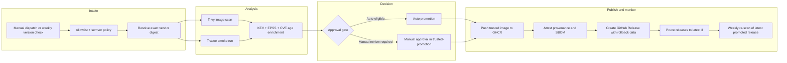

# Secure Deploy

[](https://github.com/svveec0d3/secure-deploy/actions/workflows/ci.yml)
[](https://github.com/svveec0d3/secure-deploy/actions/workflows/image-promotion.yml)
[](https://github.com/svveec0d3/secure-deploy/actions/workflows/rescan.yml)

Secure Deploy is a reference pipeline for securely ingesting, reviewing, promoting, and deploying vendor container images. This repository uses `n8nio/n8n` as the working example, but the pattern is meant to show how to combine policy, attestation, vulnerability context, and operational controls into a practical GitHub Actions workflow.

The pipeline is built around a simple principle: do not treat a container tag as trustworthy just because it exists. Resolve the exact digest, scan it, enrich the findings with additional risk signals, decide whether the image is auto-eligible or needs human approval, then publish a promoted image with an auditable release record.

## Framework Lens

This repository is easiest to understand if you look at it through four lenses:

- `SLSA`
  - Focus: software supply chain integrity and provenance
  - Use here: digest pinning, provenance attestation, SBOM attestation, release traceability

- `NIST SP 800-53`
  - Focus: baseline security and privacy controls for systems and organizations
  - Use here: access control, configuration management, auditability, integrity checks, incident visibility, least privilege

- `NIST SP 800-204D`
  - Focus: integrating software supply chain security into DevSecOps CI/CD pipelines
  - Use here: pipeline-native controls for artifacts, provenance, attestation, SBOMs, and policy-driven promotion

- `OWASP Top 10 CI/CD Security Risks`
  - Focus: the most common and damaging CI/CD-specific failure modes
  - Use here: protecting the workflow itself from bad flow control, weak IAM, dependency abuse, artifact trust failures, and poor visibility

## What This Repository Does

- Pulls vendor images only from an allowlisted source.
- Resolves and pins the immutable image digest before promotion.
- Scans the image with Trivy and enriches findings with KEV, EPSS, and CVE age.
- Captures Tracee runtime reachability data during a smoke run and reports it in vulnerability summaries.
- Uses an approval gate only when `CRITICAL` or `HIGH` findings meet this repository's manual-review criteria.
- Attests promoted images and publishes GitHub Releases with rollback details.
- Re-scans only the latest promoted release on a schedule.
- Keeps only the latest 3 promoted GitHub releases.

## Why This Exists

Typical operational risks for vendor container images:

| Risk | Why it matters | Control in this repo |
| :--- | :--- | :--- |
| Mutable tags | `latest` can change silently. | Digest pinning and semver-only tag policy |
| Weak provenance | You may not know who really produced the image. | Allowlist, cosign verification when available, attestations |
| Incomplete review | Severity alone does not reflect exploitability. | KEV, EPSS, and CVE age enrichment |
| Delayed exposure | An already-promoted image can become riskier later. | Scheduled re-scan of the latest promoted release |
| Weak audit trail | Teams need to know what was approved and why. | GitHub Releases, artifacts, job summaries |
| Unsafe runtime defaults | A good image can still run with bad container settings. | CIS-oriented runtime hardening in `iac/n8n` |

## Approval Gate Logic

The promotion gate is intentionally risk-based, not severity-only.

### What Is a CVE?

`CVE` stands for Common Vulnerabilities and Exposures. A CVE identifier such as `CVE-2026-12345` is a public reference for a known security flaw. By itself, a CVE tells you that a vulnerability exists, but it does not fully answer:

- whether the flaw is being actively exploited
- how likely exploitation is in the near term
- whether the vulnerable code path is actually exercised in your workload
- whether the issue is new and still inside a short patching window, or old and lingering

That is why this repository does not gate promotion on CVE severity alone.

### Why Additional Risk Signals Are Used

The approval gate combines several parameters because each one answers a different risk question.

| Signal | Question it answers | Why it matters for approval |
| :--- | :--- | :--- |
| CVSS / severity from Trivy | How bad could the flaw be if exploited? | Provides base prioritization |
| KEV | Is this CVE already known to be exploited in the wild? | Strong real-world urgency signal |
| EPSS | How likely is exploitation in the next 30 days? | Helps separate theoretical from likely exploitation |
| CVE age | Has the issue remained open long enough that it should no longer be treated as a fresh exception? | Prevents indefinite deferral |
| Reachability | Did the smoke run observe runtime evidence tied to the vulnerable package files? | Useful context, but not trusted enough yet for gating |

### Current Gate Policy

For `CRITICAL` and `HIGH` findings:

- Auto-promotion is allowed when the CVE is under 30 days old, not in KEV, and below this repository's manual-review EPSS threshold.
- Manual approval is required when the CVE is at least 30 days old, in KEV, or falls into this repository's `HIGH` or `CRITICAL` EPSS policy band.

`MEDIUM`, `LOW`, and `UNKNOWN` findings are still recorded and reported, but they do not directly trigger manual approval in the current policy.

## EPSS Policy Cheat Sheet

EPSS is the FIRST Exploit Prediction Scoring System. It estimates the probability that a CVE will be exploited in the next 30 days.

Example: an EPSS score of `2.1%` means an estimated `2.1%` probability of exploitation in the next 30 days. In this repository, that is above the `2.0%` manual-review threshold for `CRITICAL` and `HIGH` findings.

The table below is repository policy, not an official EPSS standard.

| EPSS score | Repository policy band | Meaning | Action |
| :--- | :--- | :--- | :--- |
| `< 0.5%` | Low | Exploitation currently looks unlikely at scale. | Does not block auto-promotion by itself |
| `0.5% to < 2.0%` | Medium | Elevated likelihood, but below manual-review threshold. | Review normally; may still auto-promote |
| `2.0% to < 10.0%` | High | Above this repository's manual-review threshold. | Manual review for `CRITICAL` and `HIGH` findings |
| `>= 10.0%` | Critical | Very high predicted exploitation likelihood. | Treat as urgent; manual review for `CRITICAL` and `HIGH` findings |

## Reachability Status

Tracee reachability data is collected and shown in the vulnerability summaries as `Reachability = Yes/No`.

Current position:

- Reachability is useful analyst context.
- Reachability is not currently used as an approval-gate parameter.

TODO:
- Verify that the current Tracee reachability method is reliable enough for policy decisions across the supported image/runtime combinations.
- Until that verification is complete, keep reachability out of the approval gate.

## 5W1H View

### What

This repository is a secure image-ingestion and promotion pipeline for vendor containers.

It does four main things:

- validates what image is being pulled
- evaluates the image with risk-enrichment signals
- decides whether the image is auto-eligible or needs manual approval
- publishes a traceable, deployable trusted image

### Why

Container image promotion is not only a vulnerability-scanning problem.

You need to answer at least four questions:

- Is this really the image we intended to trust?
- Is the vulnerability picture only severe, or also likely to be exploited?
- Do we have enough evidence to justify auto-promotion versus human approval?
- Can we later prove what was approved and roll back safely?

That is why this repository combines SLSA, NIST control thinking, NIST CI/CD supply-chain guidance, and OWASP CI/CD risk guidance instead of relying on a single scanner result.

### Who

This setup is useful for:

- platform or DevSecOps engineers who own the promotion path
- security reviewers who approve exceptions
- operators who deploy the promoted image to hosts
- auditors or incident responders who need release evidence and rollback history

### When

- `image-promotion.yml` runs when a version is submitted manually or dispatched by the weekly version checker
- `weekly-version-check.yml` runs on schedule to detect a newer upstream version
- `rescan.yml` runs weekly to reassess only the latest promoted release
- `ci.yml` runs on repository changes to validate the workflow and helper logic

### Where

Controls are applied in multiple places:

- source policy in `policy/`
- promotion and re-scan orchestration in `.github/workflows/`
- enrichment and summarization logic in `.github/scripts/`
- runtime hardening and deployment controls in `iac/n8n/`

### How

The pipeline works by layering controls rather than trusting one control to do everything:

- source and tag restrictions reduce ingestion risk
- digest pinning locks the exact artifact under review
- Trivy detects vulnerabilities
- KEV, EPSS, and CVE age refine approval decisions
- Tracee adds runtime context for analysts
- attestations and releases preserve provenance and auditability
- CIS-style Docker hardening reduces runtime blast radius after deployment

## Pipeline Flow


```mermaid
flowchart LR
    subgraph Intake["Intake"]
        A["Manual dispatch or weekly version check"]
        B["Allowlist + semver policy"]
        C["Resolve exact vendor digest"]
    end

    subgraph Analysis["Analysis"]
        D["Trivy image scan"]
        E["Tracee smoke run"]
        F["KEV + EPSS + CVE age enrichment"]
    end

    subgraph Decision["Decision"]
        G{"Approval gate"}
        H["Auto promotion"]
        I["Manual approval in trusted-promotion"]
    end

    subgraph Publish["Publish and monitor"]
        J["Push trusted image to GHCR"]
        K["Attest provenance and SBOM"]
        L["Create GitHub Release with rollback data"]
        M["Prune releases to latest 3"]
        N["Weekly re-scan of latest promoted release"]
    end

    A --> B --> C --> D
    C --> E
    D --> F
    E --> F
    F --> G
    G -->|Auto-eligible| H --> J
    G -->|Manual review required| I --> J
    J --> K --> L --> M --> N
```

## Framework Mapping

### SLSA

What it is:
- SLSA is a supply-chain security framework focused on proving software origin and reducing tampering risk in the build and release path.

Why it matters here:
- This repository is fundamentally about trusting promoted artifacts, not just scanning them.

How this repo uses it:
- immutable digest pinning before promotion
- build provenance attestation for promoted images
- SBOM attestation
- release-level evidence for rollback and auditability

Current maturity call:
- This repository is closest to `SLSA Level 3` for the promoted artifact path.

Why `Level 3` is a reasonable claim here:
- provenance is generated and attached during the GitHub Actions-controlled promotion path
- the promoted image is tied to an immutable digest
- attestation and release evidence are preserved

What keeps this from being a claim beyond that:
- this repo does not attempt to claim the highest SLSA posture across every upstream dependency or every surrounding operational component
- the vendor signature verification path is opportunistic because upstream signing availability is outside this repository's control

### NIST SP 800-53

What it is:
- NIST SP 800-53 is a catalog of security and privacy controls used to build and assess security programs.

Why it matters here:
- It gives a control-oriented way to explain why this repo has approval gates, logging artifacts, policy checks, integrity verification, and runtime restrictions.

How this repo reflects it:
- access control: manual approval in `trusted-promotion`
- configuration management: policy-as-code and semver constraints
- audit and accountability: workflow artifacts, releases, summaries
- system and information integrity: digest pinning, attestation, scanning, KEV/EPSS enrichment
- least privilege and hardening: Docker runtime constraints in `iac/n8n`

How to think about it:
- NIST SP 800-53 is the broad control backbone
- this repo is not an implementation of the whole catalog
- it is a targeted implementation of a useful subset for image promotion and deployment

### NIST SP 800-204D

What it is:
- NIST SP 800-204D is guidance on integrating software supply chain security into DevSecOps CI/CD pipelines, especially for cloud-native delivery.

Why it matters here:
- This document is unusually close to what this repo is trying to do operationally: secure the CI/CD path itself, its artifacts, and the trust decisions around promotion.

How this repo reflects it:
- policy-driven CI/CD workflow
- artifact-centric decisions around digests, SBOMs, provenance, and releases
- supply-chain evidence preserved as part of the promotion pipeline
- re-scan logic that revisits trust decisions after promotion

Why it is a strong fit:
- if SLSA explains the supply-chain integrity maturity model
- then `NIST SP 800-204D` explains how to embed those kinds of controls into an actual DevSecOps pipeline

### OWASP Top 10 CI/CD Security Risks

What it is:
- OWASP Top 10 CI/CD Security Risks is a threat-focused list of the most important CI/CD-specific risks.

Why it matters here:
- It is useful for pressure-testing the pipeline itself, not just the image being promoted.

How this repo maps to it:
- flow control mechanisms: approval gate and workflow separation
- identity and access management: GitHub environment approval and workflow permissions
- dependency chain abuse: upstream source allowlist and artifact review path
- insecure system configuration: runtime hardening and workflow policy checks
- artifact integrity validation: digest pinning, attestation, release evidence
- logging and visibility: workflow summaries, artifacts, releases, re-scan output

Practical value:
- OWASP tells you what can go wrong in CI/CD operations
- this repo shows a concrete subset of controls that reduce several of those risks

## Docker Hardening and Why It Matters

Docker hardening is not the same thing as supply-chain integrity, but it is part of the total risk picture.

How it contributes:

- SLSA and attestation help answer: "Can I trust what artifact I am deploying?"
- KEV, EPSS, and CVE age help answer: "How risky is it to promote this image?"
- Docker hardening helps answer: "If the image or workload is compromised, how much damage can the container do?"

That is why the runtime-hardening controls still matter even after image promotion succeeds.

In this repo, Docker hardening supports the overall security posture by:

- reducing privileges with `cap_drop: ALL`
- limiting privilege escalation with `no-new-privileges`
- using a read-only root filesystem where possible
- preferring non-root execution
- constraining CPU and memory
- applying AppArmor and related runtime controls

In other words:

- SLSA helps secure the artifact trust chain
- the approval gate helps secure the promotion decision
- Docker hardening helps contain runtime impact after deployment

### Workflow Summary

- `weekly-version-check.yml`
  - Checks whether a newer upstream `n8n` version exists.
  - Triggers promotion only when upstream is newer than the latest promoted release.

- `image-promotion.yml`
  - Pulls the selected upstream image.
  - Pins by digest.
  - Scans and enriches vulnerabilities.
  - Decides between auto-promotion and manual approval.
  - Publishes the trusted image and release record.
  - Prunes old releases, keeping the latest 3.

- `rescan.yml`
  - Re-scans only the latest promoted release.
  - Opens an issue if the latest promoted release now requires manual review under the current policy.

- `ci.yml`
  - Validates repository security checks and the Tracee integration path.

## Repository Structure

```text
.
├── .github/workflows/
│   ├── ci.yml
│   ├── image-promotion.yml
│   ├── rescan.yml
│   └── weekly-version-check.yml
├── .github/scripts/
│   ├── enrich_findings.py
│   ├── generate_summary.py
│   ├── merge_tracee_reachability.py
│   ├── collect_package_files.sh
│   └── run_tracee_reachability.sh
├── policy/
│   ├── image-ingestion-policy.yml
│   ├── runtime-hardening-policy.yml
│   └── vulnerability-gate-policy.yml
└── iac/n8n/
    ├── docker-compose.yml
    ├── install.sh
    ├── upgrade.sh
    └── .env.template
```

## Operating Model

### Promotion

1. Run `Image Promotion (Trusted Source)` manually, or let the weekly version check dispatch it when a newer upstream version exists.
2. The workflow resolves the exact digest and scans the image.
3. Findings are enriched with KEV, EPSS, CVE age, and reachability context.
4. The workflow either:
   - auto-promotes, or
   - pauses for review in the `trusted-promotion` environment.
5. On success, the trusted image is pushed to GHCR, attested, released, and old releases are pruned down to the newest 3.

### Re-Scan

- Schedule: every Monday at `00:00 UTC`
- Scope: latest promoted release only
- Outcome:
  - no action if still acceptable under current policy
  - GitHub issue if the latest promoted release now requires manual review

### Release Retention

- Keep the latest 3 promoted GitHub releases.
- Intended retention model:
  - latest active release
  - previous release
  - one extra rollback candidate

## Security Controls Summary

| Control | Purpose |
| :--- | :--- |
| Source allowlist | Restrict ingestion to expected vendor image source |
| Semver-only tags | Block moving targets such as mutable tags |
| Digest pinning | Ensure the scanned image is the promoted image |
| Trivy scanning | Discover package vulnerabilities across severities |
| KEV enrichment | Flag actively exploited CVEs |
| EPSS enrichment | Add near-term exploitation probability |
| CVE age tracking | Distinguish fresh issues from stale exposure |
| Tracee reachability reporting | Provide runtime context for analyst review |
| SBOM attestation | Preserve software inventory and downstream evidence |
| Provenance attestation | Provide origin and build integrity evidence |
| GitHub Releases | Preserve rollback details and approval history |

## One-Time GitHub Setup

1. Create the `trusted-promotion` environment and add required reviewers.
2. Set Actions workflow permissions to `Read and write`.
3. Ensure the `n8n-trusted` package visibility matches your intended deployment model.

## Deploying to a Host

```bash
git clone https://github.com/svveec0d3/secure-deploy.git
cd secure-deploy/iac/n8n
chmod +x install.sh
./install.sh
```

`install.sh` supports:

- selecting a target version or latest promoted release
- provenance verification with `gh attestation verify`
- runtime resource limits
- deployment and rollback support
- optional auto-upgrade via `upgrade.sh`

## References

- [SLSA v1.0](https://slsa.dev/spec/v1.0)
- [CIS Docker Benchmark](https://www.cisecurity.org/benchmark/docker)
- [NIST SP 800-53 Rev. 5](https://csrc.nist.gov/publications/sp800-53/rev-5)
- [NIST SP 800-204D](https://csrc.nist.gov/pubs/sp/800/204/d/final)
- [CISA KEV](https://www.cisa.gov/known-exploited-vulnerabilities-catalog)
- [FIRST EPSS](https://www.first.org/epss/)
- [OWASP Top 10 CI/CD Security Risks](https://owasp.org/www-project-top-10-ci-cd-security-risks/)

This README is policy-adjacent documentation. If the workflow behavior changes, keep this file aligned with the actual workflow logic.
