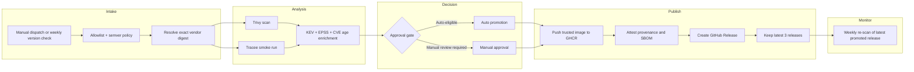

# Secure Deploy

[](https://github.com/svveec0d3/secure-deploy/actions/workflows/ci.yml)
[](https://github.com/svveec0d3/secure-deploy/actions/workflows/image-promotion.yml)
[](https://github.com/svveec0d3/secure-deploy/actions/workflows/rescan.yml)

## Industry Framing

When teams design a secure CI/CD pipeline, a few industry references are commonly used together, but for different purposes.

Think of them this way:

- `OWASP Top 10 CI/CD Security Risks` tells you what the major CI/CD threats are.
  The "Why".
- `NIST SP 800-53` gives you a control vocabulary for how organizations mitigate those threats.
  The "What".
- `SLSA` gives you a supply chain integrity model for build and artifact trust.
  The "How" for build integrity.
- `NIST SP 800-204D` explains how software supply chain controls fit into a DevSecOps CI/CD architecture.
  The "How" for the pipeline design.

Taken together, these references help answer different parts of the same question:

- what can go wrong in CI/CD
- what kinds of controls are expected
- how build and artifact integrity can be strengthened
- how those controls can be embedded into a DevSecOps delivery pipeline

This repository should be read as a practical demonstration of some of those ideas, not as a full implementation of any one framework.

## What This Repository Demonstrates

Secure Deploy is a reference repository for securely ingesting, reviewing, promoting, and deploying vendor container images. This repository uses `n8nio/n8n` as the example workload, but the main purpose is to show how a promotion pipeline can combine policy, supply chain evidence, vulnerability context, runtime hardening, and operational controls.

The central idea is simple: do not trust a vendor image tag just because it exists. Resolve the exact digest, evaluate its risk, decide whether it is auto-eligible or needs human approval, then publish a trusted image with release evidence and rollback information.

This repository currently does the following:

- restricts ingestion to an allowlisted upstream image source
- resolves and pins an immutable digest before promotion
- scans with Trivy and enriches findings with KEV, EPSS, and CVE age
- records Tracee reachability data as analyst context
- uses manual approval only for higher-risk `CRITICAL` and `HIGH` cases
- attests promoted images and publishes GitHub Releases with rollback details
- re-scans only the latest promoted release on a schedule
- retains only the latest 3 promoted GitHub releases

## Operating Context

### What

This is a secure image-ingestion and promotion pipeline for vendor containers.

### Why

Container promotion is not only a vulnerability-scanning problem. A team also needs to know:

- whether the image really came from the intended source
- whether a severe CVE is also likely to be exploited
- whether risk is low enough for automation or high enough for review
- whether the approval and rollback history can be reconstructed later

### Who

This repository is aimed at:

- platform or DevSecOps engineers operating promotion workflows
- security reviewers approving exceptions
- operators deploying promoted images
- auditors and incident responders who need release evidence

### When

- `weekly-version-check.yml` checks for a newer upstream release
- `image-promotion.yml` runs when promotion is requested
- `rescan.yml` runs weekly against the latest promoted release
- `ci.yml` validates the repo and helper logic on code changes

### Where

- workflow logic lives in `.github/workflows/`
- enrichment and reporting helpers live in `.github/scripts/`
- policy lives in `policy/`
- runtime deployment hardening lives in `iac/n8n/`

### How

The pipeline layers controls instead of depending on one control:

- policy restricts what can be ingested
- digest pinning fixes the exact artifact under review
- Trivy identifies vulnerabilities
- KEV, EPSS, and CVE age refine risk decisions
- Tracee adds runtime context
- attestations and releases preserve provenance and auditability
- Docker hardening reduces runtime blast radius after deployment

## Approval Gate

The promotion gate is intentionally risk-based, not severity-only.

### What A CVE Is

`CVE` stands for Common Vulnerabilities and Exposures. A CVE identifier such as `CVE-2026-12345` is a public identifier for a known vulnerability.

A CVE alone does not fully tell you:

- whether it is being actively exploited
- how likely exploitation is in the near term
- whether the affected code path matters for your workload
- whether the issue is still within a short remediation window or has remained exposed for a long time

That is why this repository does not treat CVE severity alone as the approval decision.

### Why More Than Severity Is Used

| Signal | What it adds |
| :--- | :--- |
| Severity | Base impact estimate if exploited |
| KEV | Evidence that the CVE is already known to be exploited in the wild |
| EPSS | Probability estimate of exploitation in the next 30 days |
| CVE age | Time dimension for whether a fresh finding is still within a short tolerance window |
| Reachability | Runtime context about whether vulnerable package files were observed during the smoke run |

### Current Gate Policy

For `CRITICAL` and `HIGH` findings:

- auto-promotion is allowed when the finding is under 30 days old, not in KEV, and below this repository's manual-review EPSS threshold
- manual approval is required when the finding is at least 30 days old, appears in KEV, or falls into this repository's `HIGH` or `CRITICAL` EPSS policy band

`MEDIUM`, `LOW`, and `UNKNOWN` findings are still reported, but they do not currently trigger manual approval on their own.

## EPSS Policy

EPSS is the FIRST Exploit Prediction Scoring System. It estimates the probability that a CVE will be exploited in the next 30 days.

Example: an EPSS score of `2.1%` means an estimated `2.1%` probability of exploitation in the next 30 days. In this repository, that is above the `2.0%` manual-review threshold for `CRITICAL` and `HIGH` findings.

The table below is repository policy, not an official EPSS standard.

| EPSS score | Repository policy band | Meaning | Action |
| :--- | :--- | :--- | :--- |
| `< 0.5%` | Low | Exploitation currently looks unlikely at scale | Does not block auto-promotion by itself |
| `0.5% to < 2.0%` | Medium | Elevated likelihood, but below manual-review threshold | May still auto-promote if other gate checks are clear |
| `2.0% to < 10.0%` | High | Above this repository's manual-review threshold | Manual review for `CRITICAL` and `HIGH` findings |
| `>= 10.0%` | Critical | Very high predicted exploitation likelihood | Treat as urgent; manual review for `CRITICAL` and `HIGH` findings |

## Reachability Status

Tracee reachability data is collected and shown in vulnerability summaries as `Reachability = Yes/No`.

Current status:

- reachability is useful analyst context
- reachability is not currently used as an approval-gate input

TODO:

- verify that the current Tracee-based reachability approach is reliable enough across the supported image and runtime combinations
- until that verification is complete, keep reachability out of the approval gate

## Workflow


```mermaid
flowchart LR
    subgraph Intake["Intake"]
        A["Manual dispatch or weekly version check"]
        B["Allowlist + semver policy"]
        C["Resolve exact vendor digest"]
    end

    subgraph Analysis["Analysis"]
        D["Trivy scan"]
        E["Tracee smoke run"]
        F["KEV + EPSS + CVE age enrichment"]
    end

    subgraph Decision["Decision"]
        G{"Approval gate"}
        H["Auto promotion"]
        I["Manual approval"]
    end

    subgraph Publish["Publish"]
        J["Push trusted image to GHCR"]
        K["Attest provenance and SBOM"]
        L["Create GitHub Release"]
        M["Keep latest 3 releases"]
    end

    subgraph Monitor["Monitor"]
        N["Weekly re-scan of latest promoted release"]
    end

    A --> B --> C --> D
    C --> E
    D --> F
    E --> F
    F --> G
    G -->|Auto-eligible| H --> J
    G -->|Manual review required| I --> J
    J --> K --> L --> M --> N
```

### Workflow Roles

- `weekly-version-check.yml`
  - checks whether a newer upstream `n8n` release exists
  - dispatches promotion only when upstream is newer than the latest promoted release

- `image-promotion.yml`
  - resolves the upstream version and digest
  - scans and enriches findings
  - decides between auto-promotion and manual approval
  - publishes the trusted image, attestations, and release
  - prunes older releases down to the newest 3

- `rescan.yml`
  - re-scans only the latest promoted release
  - opens an issue if the latest promoted release now crosses the manual-review threshold

- `ci.yml`
  - validates repository security checks and helper logic

## Framework Mapping

This repository is easier to reason about when the frameworks are used for explanation rather than for broad compliance claims.

### SLSA

What it is:
- a framework for improving software supply chain integrity and provenance

How it is used here:
- immutable digest pinning before promotion
- provenance attestation for promoted images
- SBOM attestation
- release evidence tied to the promoted artifact

Current maturity statement:
- the promoted artifact path is designed to align most closely with `SLSA Level 3` concepts
- this should not be read as an independent certification or universal claim over every upstream dependency or surrounding platform component

Why this is the closest fit:
- provenance is generated in a controlled GitHub Actions path
- promoted artifacts are tied to immutable digests
- attestation and release evidence are preserved for verification and audit use

In short:
- OWASP helps explain the threat model
- NIST SP 800-53 helps explain the control mindset
- SLSA helps explain artifact integrity and provenance
- this repository uses those ideas to demonstrate a promotion path that is closer to SLSA Level 3 concepts than to lower-maturity ad hoc promotion

### NIST SP 800-53

What it is:
- a catalog of security and privacy controls for information systems and organizations

How it is used here:
- as a control-oriented lens for explaining why the repo has approval gates, audit records, policy checks, integrity controls, and least-privilege runtime configuration

Examples reflected in this repo:
- access control via manual approval in `trusted-promotion`
- configuration management via policy-as-code and version constraints
- auditability via workflow artifacts, summaries, and releases
- integrity controls via digest pinning, attestation, and scanning
- least privilege via Docker runtime hardening

This repo does not claim full NIST SP 800-53 implementation. It applies a practical subset of ideas relevant to image promotion and deployment.

### NIST SP 800-204D

What it is:
- NIST guidance on strategies for integrating software supply chain security into DevSecOps CI/CD pipelines

How it is used here:
- as the closest architectural lens for the pipeline itself
- the repo applies policy-driven CI/CD decisions around digests, provenance, SBOMs, release evidence, and post-promotion review

Why it fits well:
- SLSA helps describe supply chain integrity maturity
- NIST SP 800-204D helps explain how those integrity controls fit into an operational DevSecOps pipeline

This repo should be described as aligned with parts of that guidance, not as a blanket implementation claim.

### OWASP Top 10 CI/CD Security Risks

What it is:
- an OWASP project that identifies major CI/CD-specific security risks

How it is used here:
- as a threat model for the pipeline, not just the image

Examples that map well:
- insufficient flow control mechanisms
- inadequate identity and access management
- dependency chain abuse
- insecure system configuration
- improper artifact integrity validation
- insufficient logging and visibility

This repository reduces several of those risks through workflow separation, approval gating, workflow permissions, attestation, policy checks, and release evidence.

## Docker Hardening

Docker hardening is not the same thing as supply chain integrity, but it still matters.

How to think about the split:

- supply chain controls answer: "Can I trust what artifact I am promoting?"
- approval-gate controls answer: "Is the current risk low enough for automation?"
- Docker hardening answers: "If the workload or image is compromised, how much damage can the container do?"

In this repository, runtime hardening contributes by:

- dropping capabilities with `cap_drop: ALL`
- limiting privilege escalation with `no-new-privileges`
- using a read-only root filesystem where practical
- preferring non-root execution
- constraining CPU and memory
- applying AppArmor and related runtime restrictions

This means Docker hardening does not raise SLSA maturity by itself. Instead, it complements the supply chain controls by reducing runtime blast radius after deployment.

## Repository Structure

```text
.
├── .github/workflows/
│   ├── ci.yml
│   ├── image-promotion.yml
│   ├── rescan.yml
│   └── weekly-version-check.yml
├── .github/scripts/
│   ├── collect_package_files.sh
│   ├── enrich_findings.py
│   ├── generate_summary.py
│   ├── merge_tracee_reachability.py
│   └── run_tracee_reachability.sh
├── policy/
│   ├── image-ingestion-policy.yml
│   ├── runtime-hardening-policy.yml
│   └── vulnerability-gate-policy.yml
└── iac/n8n/
    ├── .env.template
    ├── docker-compose.yml
    ├── install.sh
    └── upgrade.sh
```

## Operating Model

### Promotion

1. Run `Image Promotion (Trusted Source)` manually, or let the weekly version check dispatch it when a newer upstream version exists.
2. The workflow resolves the exact digest and evaluates the image.
3. Findings are enriched with KEV, EPSS, CVE age, and reachability context.
4. The workflow either auto-promotes or pauses for manual approval.
5. On success, the trusted image is pushed to GHCR, attested, released, and old releases are pruned down to the newest 3.

### Re-Scan

- schedule: every Monday at `00:00 UTC`
- scope: latest promoted release only
- outcome:
  - no action if it remains acceptable under the current gate policy
  - issue creation if it now requires manual review

### Release Retention

- keep the latest 3 promoted GitHub releases
- intended purpose:
  - current release
  - previous release
  - one additional rollback candidate

## Deployment

```bash
git clone https://github.com/svveec0d3/secure-deploy.git
cd secure-deploy/iac/n8n
chmod +x install.sh
./install.sh
```

`install.sh` supports:

- selecting a target version or latest promoted release
- provenance verification with `gh attestation verify`
- runtime resource limits
- deployment and rollback support
- optional auto-upgrade with `upgrade.sh`

## References

- [CISA KEV](https://www.cisa.gov/known-exploited-vulnerabilities-catalog)
- [CIS Docker Benchmark](https://www.cisecurity.org/benchmark/docker)
- [FIRST EPSS](https://www.first.org/epss/)
- [NIST SP 800-204D](https://csrc.nist.gov/pubs/sp/800/204/d/final)
- [NIST SP 800-53 Rev. 5](https://csrc.nist.gov/pubs/sp/800/53/r5/upd1/final)
- [OWASP Top 10 CI/CD Security Risks](https://owasp.org/www-project-top-10-ci-cd-security-risks/)
- [SLSA v1.0 specification](https://slsa.dev/spec/v1.0/)

This README is descriptive documentation for the current workflow behavior. If the workflows or policies change, this document should be updated to match the implementation.
